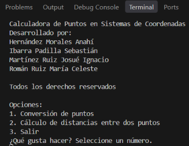
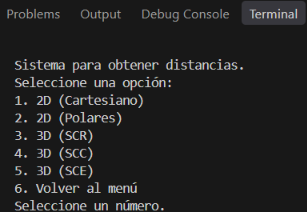

# Calculadora de Puntos en Sistemas de Coordenadas

Calculadora de consola en Java que convierte puntos entre sistemas de coordenadas 2D y 3D y calcula la distancia entre dos puntos en cada uno de ellos.

## Tecnologías

- **Lenguaje:** Java (JDK 15 o superior, por el uso de bloques de texto `"""`)
- **Librerías:** solo la biblioteca estándar (`java.util.Scanner`, `java.lang.Math`)
- **Frameworks / base de datos:** ninguno

## Estructura

```
calculadoraFisica.java (menús, conversiones y distancias)
README.md
```

## Cómo ejecutarlo

```bash
javac calculadoraFisica.java
java calculadoraFisica
```

## Funciones principales

**Menú principal:** conversión de puntos, cálculo de distancias y salir.

### Conversiones
- **2D:** Cartesiano → Polar y Polar → Cartesiano
- **3D:** entre SCR (rectangular), SCC (cilíndrico) y SCE (esférico), las 6 combinaciones posibles

### Distancias entre dos puntos
- 2D cartesiano
- 2D polar
- 3D en SCR, SCC y SCE

### Otras características
- Repetición de cálculos sin volver al menú
- Validación de entradas no numéricas (el programa no se cierra)
- Ángulos introducidos en grados y resultados con 2 decimales

## Capturas

### Menú principal


### Menú de distancias


### Ejemplo: distancia entre dos puntos en SCR
Para los puntos (1, 2, 3) y (3, 4, 2) la distancia es 3.00.


## Desarrollado por

- Hernández Morales Anahí
- Ibarra Padilla Sebastián
- Martínez Ruiz Josué Ignacio
- Román Ruiz María Celeste

Proyecto realizado para la Universidad de Sonora, Ingeniería en Sistemas de Información.
